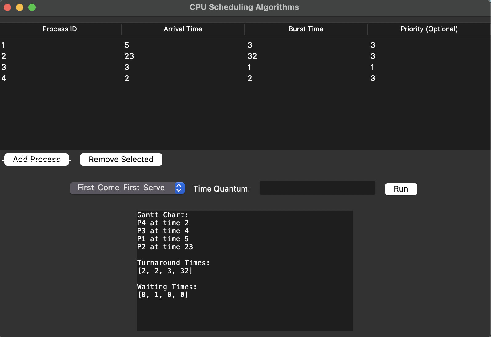

# Scheduling Algorithms

This project implements two scheduling algorithms in Python:

1. **First-Come-First-Serve (FCFS)** Scheduling
2. **Priority Scheduling**

## How It Works

### First-Come-First-Serve (FCFS)
Processes are scheduled in the order they arrive. The Gantt chart is generated by sorting the processes based on their arrival times and executing them sequentially.

### Priority Scheduling
Processes are scheduled based on their priority (lower priority value indicates higher priority). If two processes have the same priority, the one with the earlier arrival time is executed first.

## Input Format
Each process is represented as a dictionary with the following keys:
- `id`: Unique process ID
- `arrival`: Arrival time of the process
- `burst`: Burst time (execution time) required by the process
- `priority`: (Optional) Priority of the process

Example input:
```python
processes = [
    {'id': 1, 'arrival': 5, 'burst': 3, 'priority': 3},
    {'id': 2, 'arrival': 23, 'burst': 32, 'priority': 3},
    {'id': 3, 'arrival': 3, 'burst': 1, 'priority': 1},
    {'id': 4, 'arrival': 2, 'burst': 2, 'priority': 3}
]
```

## Output Format
The output is a Gantt chart represented as a list of tuples:
- Each tuple contains the process ID and the time at which the process started execution.

Example output for FCFS:
```
[(4, 2), (3, 4), (1, 5), (2, 23)]
```

## Files
- `labexam2.py`: Contains the implementation of the FCFS and Priority Scheduling algorithms.
- `README.md`: This documentation file.

## Usage
Run the script in any Python environment to see the scheduling results and Gantt charts.


---
